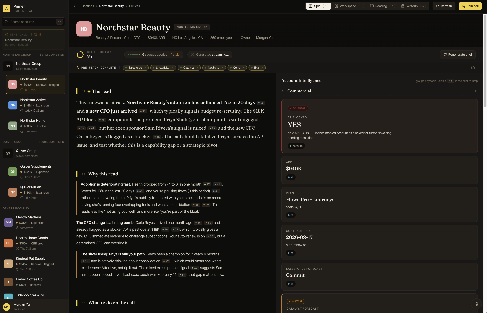
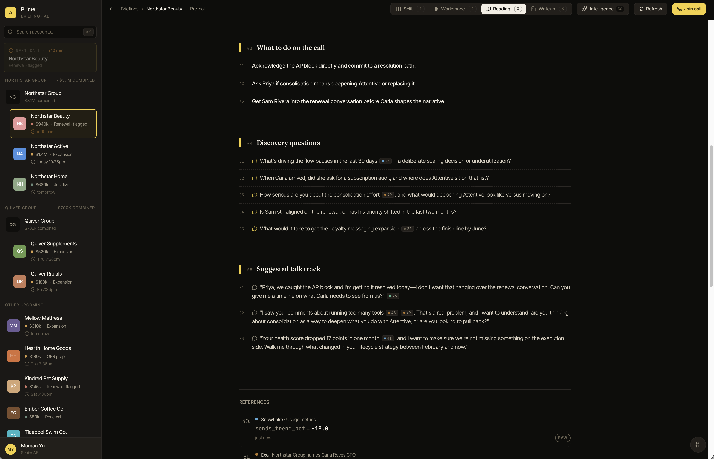
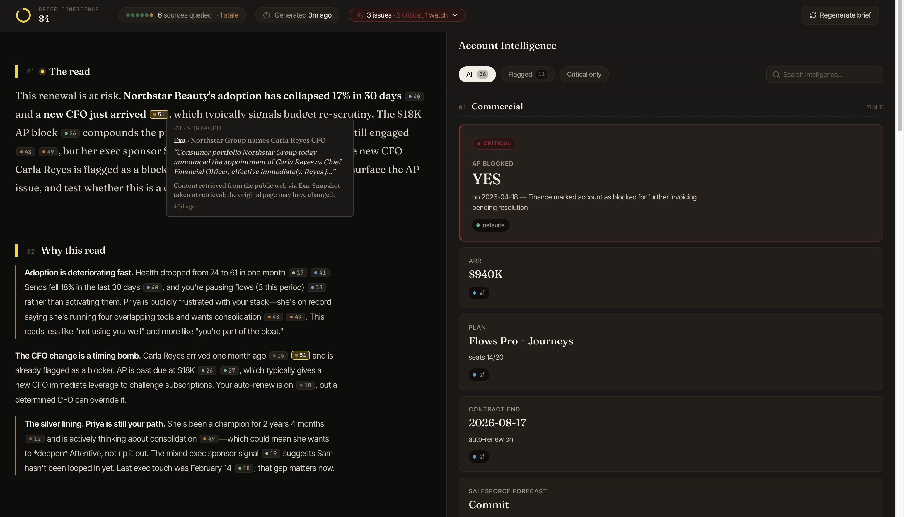
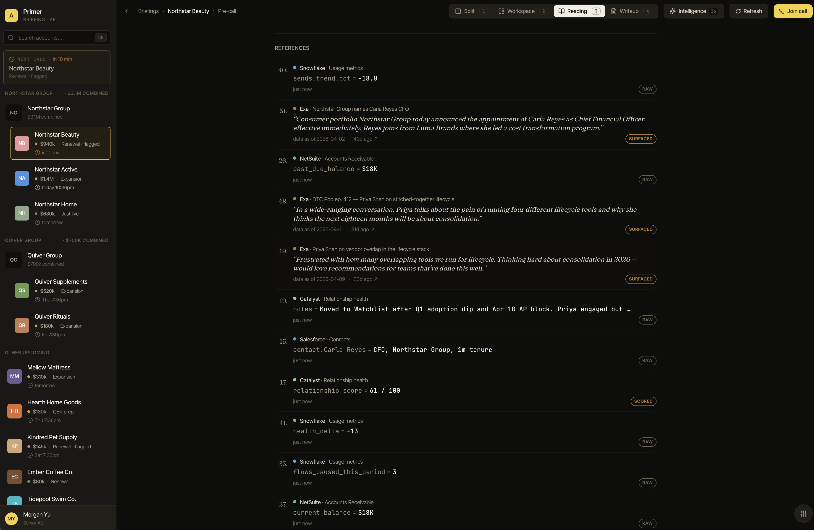
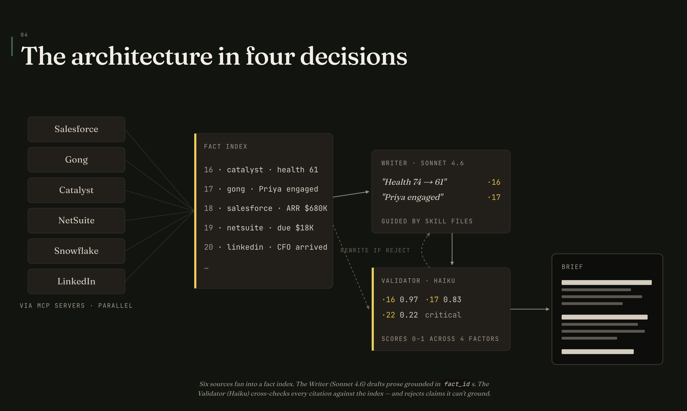

# Primer

A pre-call briefing product for enterprise Account Executives. The rep selects
an account before a call; Primer composes a three-paragraph brief with source
citations and a streaming Account Intelligence panel that populates in under
two seconds.

Built as a takehome submission in April 2026. The writeup lives inside the
product as Mode 4 — open the prototype, click **About this build** in the mode
switcher.

**Try it live**: https://primer.5.161.116.216.sslip.io

---

## See it work



*The Split view while a brief is generating. Six MCP servers — Salesforce, Snowflake, Catalyst, NetSuite, Gong, Exa — fan out in parallel. Each source lights up as it returns data and populates the Account Intelligence panel on the right, topic-by-topic.*



*Reading mode after the stream completes. The brief is three paragraphs of opinionated, hedged prose. Each gold chip (·n) is a fact_id that maps back to a raw row in one of the source systems. Facts are cited; inferences are hedged ("appears", "likely", "suggests").*



*Zoomed view showing how every claim is qualified by a citation. The validation agent runs in parallel during generation and flags statements that contradict the underlying data — keeping the brief grounded.*



*The references list after the brief. Every numbered citation shows its source system, the field, the raw value, and the snippet or timestamp. A reader can trace any chip back to its origin in two clicks.*



*The architectural writeup ships inside the product as Mode 4. No separate PDF or linked document — the thing being read sits inside the thing it describes. The architecture claim: MCP is a read layer, so the writeup is just another view over the same orchestrator.*

---

## What it is

- One URL, four modes: **Reading**, **Prep**, **Split**, and **About this build** (writeup)
- Six real MCP servers (Salesforce, Snowflake, Catalyst, NetSuite, Gong, Exa), one per source system, stdio transport
- FastAPI orchestrator that fans out MCP queries in parallel, then hands the bundle to Claude with streaming tool use
- A separate validation agent re-reads the draft against the raw data and flags contradictions before they render
- Next.js 15 + Tailwind v4 frontend, SSE-driven, with inline source chips and hedged voice for inferences

The architectural claim is that this is a **read layer, not a write layer**.
MCP wraps existing systems, Primer reasons across them, and never mutates
upstream state. When an internal RevTech team ships a unified data layer, the
MCP servers repoint — the product doesn't change.

## Architecture at a glance

```
┌─────────────────┐       SSE       ┌──────────────────┐
│  Next.js 15     │ ──────────────▶ │  FastAPI         │
│  (port 3000)    │                 │  orchestrator    │
│                 │◀───── JSON ──── │  (port 8000)     │
└─────────────────┘   /api/*        └──────┬───────────┘
                                           │ stdio
                  ┌────────────────────────┼────────────────────────┐
                  ▼            ▼           ▼            ▼           ▼
             ┌────────┐  ┌──────────┐ ┌──────────┐ ┌────────┐  ┌──────┐
             │ SFDC   │  │Snowflake │ │Catalyst  │ │NetSuite│  │ Gong │  ... (+ Exa)
             │ MCP    │  │MCP       │ │MCP       │ │MCP     │  │ MCP  │
             └────┬───┘  └────┬─────┘ └────┬─────┘ └────┬───┘  └──┬───┘
                  └───────────┴────────────┴────────────┴─────────┘
                                     │
                              ┌──────▼───────┐
                              │ SQLite       │
                              │ primer.db    │  (seeded fixtures, read-only at runtime)
                              └──────────────┘

                  ┌──────────┐
                  │  Redis   │  brief cache + rate limit
                  └──────────┘

                  ┌──────────────┐
                  │  Anthropic   │  Claude (streaming tool_use) + validation pass
                  │  API         │
                  └──────────────┘
```

All components run on one Hetzner CPX21 behind nginx. HTTPS via Let's Encrypt.
See `specs/06_DEPLOYMENT_SPEC.md` and `docs/ARCHITECTURE.md` for the full
picture.

## Running locally

### Prerequisites

- Python 3.12+ (`pyenv` or system)
- Node 20+ and npm
- Redis running locally (`brew install redis && brew services start redis`)
- `uv` (`pip install uv` or `brew install uv`)
- An Anthropic API key in `.env` (see `.env.example`)

### First run

```bash
# 1. Clone + enter the repo
git clone git@github.com:nick-ruzicka/primer-attentive.git
cd primer-attentive

# 2. Environment
cp .env.example .env
# Fill in ANTHROPIC_API_KEY at minimum

# 3. Python deps + seeded DB
uv sync
uv run python data/seed.py

# 4. Backend (terminal A)
uv run uvicorn backend.main:app --reload --port 8000

# 5. Frontend (terminal B)
cd frontend
npm install
npm run dev
```

Open <http://localhost:3000>. Select an account in the left rail; the brief
streams in 3–4 seconds.

### Smoke tests

```bash
curl http://localhost:8000/api/accounts | jq
curl -N http://localhost:8000/briefing/northstar_beauty   # SSE stream
```

## Deploying

See `specs/06_DEPLOYMENT_SPEC.md` for the full deploy story. Short version:

```bash
# One-time, on a fresh Hetzner CPX21 as root:
scp deploy/setup_server.sh root@<IP>:/root/
ssh root@<IP> PRIMER_DOMAIN=primer.your-domain.com bash /root/setup_server.sh

# Every subsequent deploy, from your laptop:
PRIMER_SERVER=root@<IP> scripts/deploy.sh
```

- `scripts/deploy.sh` mirrors the Chariot Signal Engine pattern: push, SSH,
  git pull, rebuild, `systemctl restart`.
- `DRY_RUN=1 scripts/deploy.sh` prints every step without executing.
- nginx reverse-proxies `/` to Next.js (3000), `/api/*` and `/briefing/*` to
  FastAPI (8000). The `/briefing/*` block has `proxy_buffering off` so SSE
  works.

## Repo layout

```
primer-attentive/
├── backend/               # FastAPI app, MCP client, Claude agent
├── mcp_servers/           # six stdio MCP servers, one per source system
├── data/                  # SQLite schema, seed SQL, seeded fixtures (8-10 accounts)
│   ├── schema.sql
│   ├── seed.py
│   └── primer.db          # gitignored; regenerated from seed.py
├── frontend/              # Next.js 15 + Tailwind v4 + TypeScript
├── deploy/                # nginx conf, systemd units, Loom script, writeup draft
├── scripts/               # deploy.sh and other operator scripts
├── docs/                  # architecture + decisions (optional deeper-read)
├── specs/                 # the specs the four terminals were built against
├── .env.example
├── .github/workflows/ci.yml
├── LICENSE
└── README.md
```

## Where the thinking lives

- `specs/00_BUILD_PLAN.md` — the four-terminal parallelized build plan
- `specs/01–04` — dataset, MCP, orchestrator, agent specs
- `specs/05_FRONTEND_SPEC.md` — design tokens and component tree
- `specs/06_DEPLOYMENT_SPEC.md` — Hetzner + nginx + systemd
- `specs/07_WRITEUP_INTEGRATION_SPEC.md` — the writeup-as-Mode-4 plan
- `docs/ARCHITECTURE.md` — end-to-end request walkthrough
- `docs/DECISIONS.md` — the tradeoffs, with rationale
- **The writeup itself ships inside the app as Mode 4.** It is the thing to read.

## License

MIT. See [LICENSE](LICENSE).
